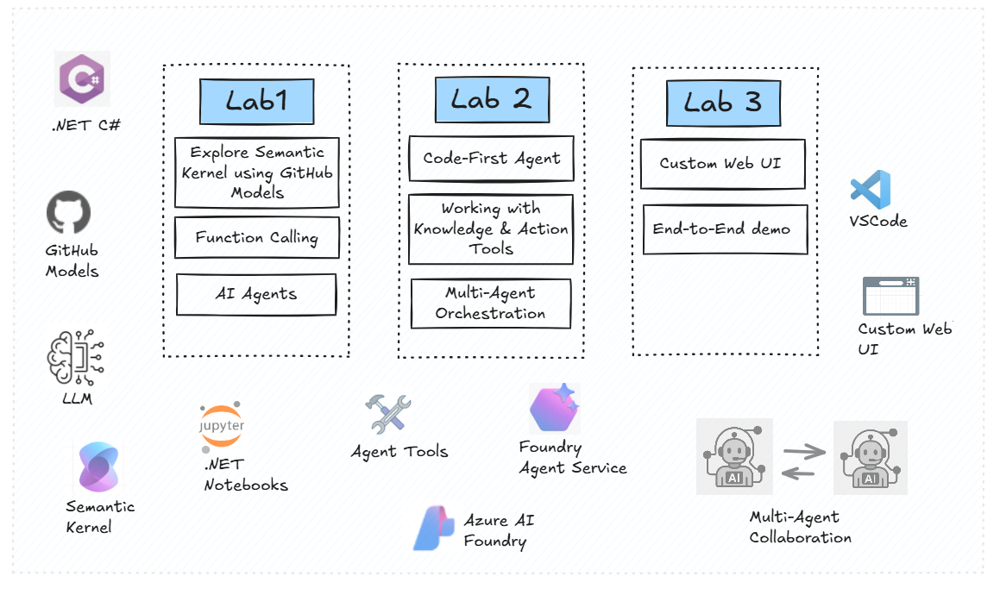

# Getting Started 🚀

Welcome to the AI Agent Workshop!

This workshop is designed to help you build AI agents using Semantic Kernel and Azure AI Foundry.

Whether you're a beginner or an experienced developer, you'll find valuable insights and hands-on experience throughout the labs.

## What we wil explore in this workshop

- The basics of interacting with Large Language Models (LLMs) using Semantic Kernel SDK, .NET C#.
- GitHub-hosted models – GitHub offers free access to a variety of Large Language Models (LLMs), making it easy to prototype and experiment with different models in your projects.
- Azure AI Foundry - It is Microsoft's secure, flexible, and scalable platform for building AI applications and agents.
- Build your own AI agents by defining goals, tools, and memory.
- Explore built-in tools in AI Foundry Agent Service - file search, OpenAPI spec tool.
- Connect multiple agents together to create complex workflows.

## How Does the Workshop Work?

- You will be using **GitHub Codespaces** to run the labs. This provides a ready-to-use environment with all the necessary tools pre-installed.
- You will work through 3 labs in this workshop:

    - **Lab 1**: Explore Semantic Kernel using GitHub Models
    - **Lab 2**: Build AI Agents with Azure AI Foundry
    - **Lab 3**: Custom Web UI for interacting with AI Agents

- The labs is presented as a **notebook** with step-by-step instructions and code snippets to guide you through the exercises. You will also find links to additional resources and documentation for further reading.

- The labs are meant to be completed in order, as each builds on the knowledge and skills acquired in the previous one. 

    But feel free to skip the sections that you are already familiar with.

---

## Let's get started 👩‍💻🤖

Head over to the [Environment Setup](./00-setup_instructions.md) page for instructions on setting up your workshop environment.

Happy coding!
